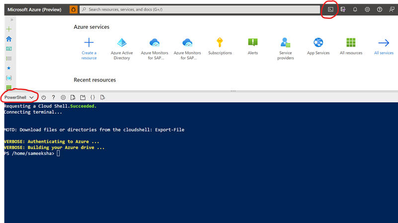
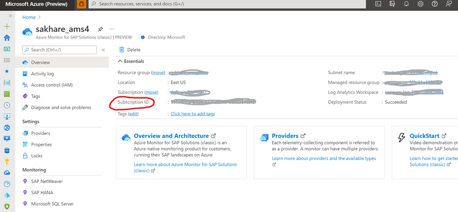
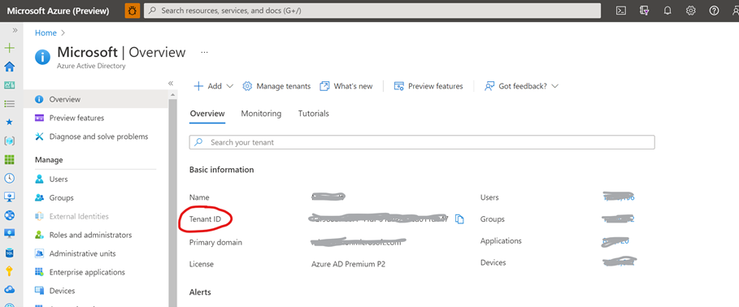
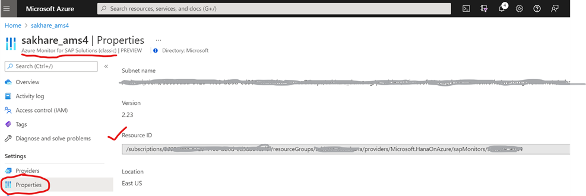
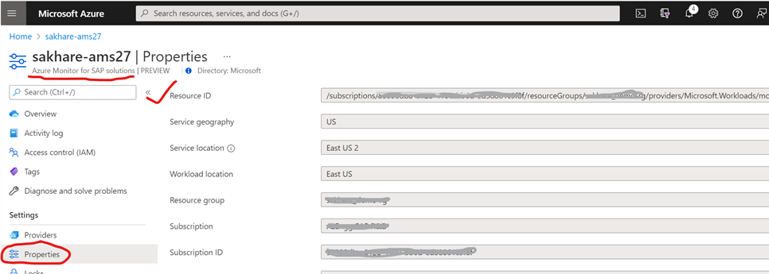
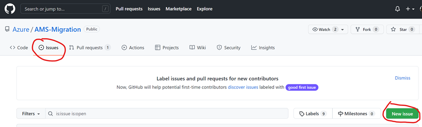

# README (for migration)

> Older version of product will be referred to as Azure Monitor for SAP Solutions (classic) or AMS (classic). AMS (classic) is currently in public preview.

> **New** version of the product will be referred to as Azure Monitor for SAP solutions or AMS. AMS is currently in private preview and is subjected to allow-listing of subscription.

Below are steps to migrate AMS (classic) to AMS monitor resource.

## Pre-requisite

- **Deploy new AMS resource:** Please follow [AMS onboarding wiki](https://github.com/Azure/Azure-Monitor-for-SAP-solutions-preview/wiki) to deploy new AMS resource manually.  <i>Please note</i>: While following onboarding wiki, please deploy only the AMS resource (without providers). Providers will be migrated automatically using the automation script (instructions below).  <i>Please note:</i>: To retain previously collected telemetry data please select checkbox for &quot;Use existing log analytics workspace&quot; while creating new AMS resource. Instructions can be found in boarding wiki. This selection will ensure that log analytics workspace associated with your current AMS (classic) resource is used with new AMS resource. Therefore, you will be able to retain previously collected telemetry.

- **Hosts file entries:** If you have one or more active SAP NetWeaver provider, this pre-requite is for you. Please keep hosts.json file or contents of hosts.json file handy. One way to get to contents of hosts.json file by logging into collector VM of AMS (classic) managed resource group. (@mohit to put steps after talking to Suhani)

## Migration steps
> Continue running AMS (Azure Monitor for SAP Solutions) 1.0 as is. Assuming you have completed the pre-requisite you should have a successfully deployed AMS, follow the cmds below to automatically migrate all your SAP HANA &amp; SAP NetWeaver providers.
	
1. Log into [Azure Portal](https://ms.portal.azure.com) and open PowerShell. Alternatively, you can use your local PowerShell.  

2. Clone migration GitHub repository   <pre><code>git clone <a href="https://github.com/Azure/AMS-Migration.git">https://github.com/Azure/AMS-Migration.git</a></code></pre>
3. Set context of migration by providing your subscription ID and Tenant ID.
	<pre><code>[string]$subscriptionId = &quot;\&lt;subscription ID\&gt;&quot;  [string]$tenantId = &quot;\&lt;Tenant ID\&gt;&quot;  Set-AzContext -Subscription $subscriptionId -Tenant $tenantId;</code></pre>
	You can find your subscription ID by navigating to your AMS (classic) resource -> overview page.
	

	You can find tenant ID by navigating to Azure Active Directory in Azure portal -> overview page.
	

4. Select which providers you want to migrate. You can choose between 3 options **(We recommend Option 1)**
    - Option 1: All providers - Migrates all SAP HANA &amp; SAP NetWeaver providers
    - Option 2: &quot;saphana&quot; providers – Migrates all SAP HANA providers
    - Option 3: &quot;sapnetweaver&quot; providers – Migrates all SAP NetWeaver providers

5. Set the providerType variable accordingly:
	<pre><code>
	[string]$providerType = &quot;all&quot;
	OR 
	[string]$providerType = &quot;saphana&quot;
	OR
	[string]$providerType = &quot;sapnetweaver&quot;
	</code></pre>

6. Provider the AMS (classic) resource ARM ID and new AMS resource ARM ID. You can find those by navigating to AMS resource -\&gt; properties -\&gt; Resource ID. Then, execute the following cmds:
	<pre><code>
	[string]$amsv1ArmId = &quot;&lt;AMS (classic) ARM ID&gt;&quot;
	[string]$amsv2ArmId = &quot;&lt;AMS ARM ID&gt;&quot;
	</code></pre>
	Find resource ID for AMS (classic) resource:  
	
	  
	Find resource ID for AMS resource:  
	

7. Final script should look like this:
	<pre><code>
	[string]$providerType = &quot;all&quot;
	[string]$amsv1ArmId = &quot;&lt;AMS (classic) ARM ID&gt;&quot;
	[string]$amsv2ArmId = &quot;&lt;AMS ARM ID&gt;&quot;	
	$command = ".\AMS-Migration\src\Migration.ps1 -providerType $providerType -amsv1ArmId $amsv1ArmId -amsv2ArmId $amsv2ArmId";
	Invoke-Expression $command</code></pre>
	After the script executes successfully, you will see the following output. (@Mohit to put screenshot)

## Optional but HIGHLY Recommended 

After successfully migrating all SAP HANA &amp; SAP NetWeaver providers, navigate back to AMS (classic) resource and manually delete all SAP HANA &amp; SAP NetWeaver providers. Since these providers have already migrated to AMS resource you will continue to receive monitoring telemetry in same Log Analytics workspace from these.

<i>Please note</i>: You can choose to not delete these providers in AMS (classic) resource after successfully migrating these providers – AMS will work just fine. However, you will incur additional costs on log analytics workspace since duplicate data will get pumped into it (from both AMS (classic) and AMS). Therefore, we highly recommend that you delete all successfully migrated providers from AMS (classic) resource.

## Optional: 
manually recreate all alert rules for SAP HANA &amp; SAP NetWeaver in new AMS resource.

If you have other providers besides SAP HANA &amp; SAP NetWeaver, please check this guide next month. AMS engineering team is planning to support other providers such as High-availability (pacemaker) cluster, SQL Server and OS in coming months.

> Please DO NOT DELETE AMS (classic) resource even after successfully migrating all providers.

> Please DO NOT DELETE AMS (classic) managed resource group even after successfully migrating all providers.

For data continuity purpose, if you are reusing the log analytics workspace from AMS (classic) for AMS, deleting either AMS (classic) resource or managed resource group will lead to deletion of log analytics workspace. Unfortunately, that would lead to losing all previously collected telemetry from AMS (classic) and halt new telemetry collection from AMS.

## Support

Please use &#39;Issues&#39; in GitHub repository to open support cases for AMS engineering team.

